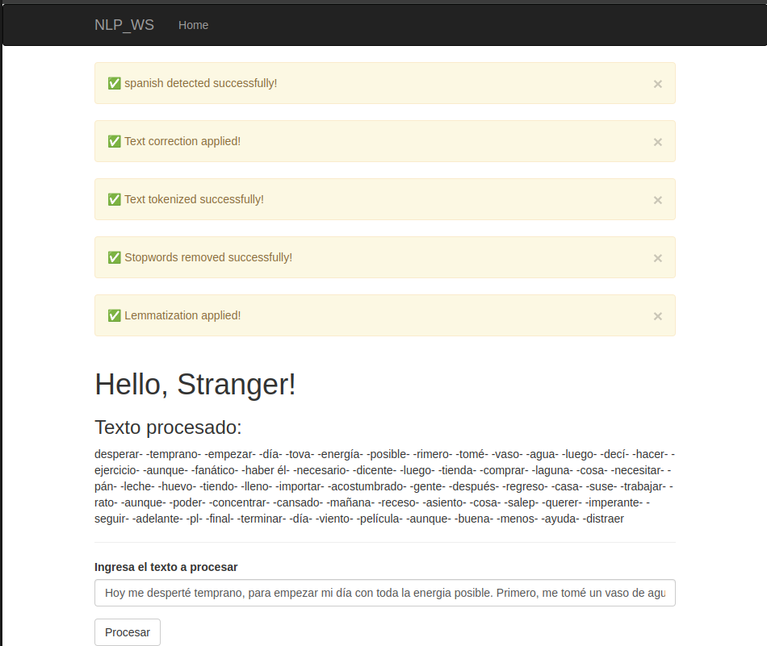

# SRI - Sistema de Reconocimiento e Interpretación

## Descripción

nlp_ws es un sistema para el procesamiento y análisis de texto en múltiples idiomas. Su arquitectura de microservicios incluye una API para la gestión de diccionarios de varios idomas y una interfaz web para la interacción con los usuarios. El objetivo del proyecto es facilitar la normalización, reconocimiento e interpretación de datos textuales mediante técnicas de procesamiento del lenguaje natural (NLP).

## Estructura del Proyecto
```
.
├── api                 # Servicio web para procesamiento de texto
│   ├── dic            # Diccionarios de idiomas admitidos
│   ├── process.py     # Api endpoins escrita en flask
├── app                 # Aplicación web
│   ├── app.py         # Punto de entrada de la interfaz
│   ├── static         # Recursos estáticos (favicon, estilos, scripts)
│   ├── templates      # Plantillas HTML para la interfaz gráfica
├── requirements.txt    # Lista de dependencias del proyecto
├── venv                # Entorno virtual de Python
├── img                # Imagenes
```

## Endpoints de la API

La API del sistema, desarrollada en Flask, expone los siguientes endpoints para procesar texto:

- **Detección de idioma** (`POST /get_language_text`): Determina el idioma del texto ingresado.
- **Corrección de palabras** (`POST /fix_words`): Aplica correcciones ortográficas según el idioma detectado.
- **Tokenización** (`POST /tokenize`): Divide el texto en unidades léxicas (tokens).
- **Eliminación de palabras vacías** (`POST /remove_stopwords`): Filtra términos irrelevantes para el análisis.
- **Lematización** (`POST /get_lemmas`): Obtiene la forma base de cada palabra para su procesamiento.

El servicio web corre en el puerto `5000`, mientras que la interfaz web opera en el puerto `5001`.

## Instalación

1. Clona el repositorio:
   ```bash
   git clone <URL_DEL_REPOSITORIO>
   cd nlp_ws
   ```
2. Configura un entorno virtual y actívalo:
   ```bash
   python3 -m venv venv
   source venv/bin/activate  # En Linux/macOS
   venv\Scripts\activate     # En Windows
   ```
3. Instala las dependencias necesarias:
   ```bash
   pip install -r requirements.txt
   ```

## Uso

### Ejecutar la API

Navega al directorio `api` y ejecuta:

```bash
flask --app process.py run
```

### Ejecutar la aplicación web

Desde el directorio `app`, inicia el servidor:

```bash
flask run --port 5001
```

Luego, accede a la interfaz en `http://localhost:5001`.

### Escribe el texto a probar en la interfaz web


## Flujo de Procesamiento

El sistema sigue los siguientes pasos para procesar un texto, la interfaz se comunica con el api siguiendo el siguiente flujo

1. **Detección del idioma**
   - Se envía una solicitud al endpoint de detección de idioma.
   ```python
   response = requests.post(api_endpoints['detect_language'], json={'text': original_text})
   lang = response.json().get("detected_language", "unknown")
   ```
2. **Corrección de palabras**
   - Se corrigen errores ortográficos con base en el idioma detectado.
   ```python
   response = requests.post(api_endpoints['fix_words'], json={'text': original_text, 'lang': lang})
   processed_text = response.json().get("text", original_text)
   ```
3. **Tokenización**
   - Se divide el texto en palabras o unidades léxicas.
   ```python
   response = requests.post(api_endpoints['tokenize'], json={'text': processed_text})
   processed_text = response.json().get("tokens", [])
   ```
4. **Eliminación de palabras vacías (stopwords)**
   - Se filtran términos irrelevantes.
   ```python
   response = requests.post(api_endpoints['remove_stopwords'], json={'tokens': processed_text, 'lang': lang})
   processed_text = response.json().get("text", processed_text)
   ```
5. **Lematización**
   - Se obtiene la forma base de cada palabra.
   ```python
   response = requests.post(api_endpoints['get_lemmas'], json={'text': processed_text, 'lang': lang})
   lemmas_data = response.json().get("lemmas", [])
   processed_text = "-".join(item["lemma"] for item in lemmas_data)
   ```
# Sobre los endpoins

### 1. **`/get_language_text` - Detección de idioma**
   Este endpoint permite detectar el idioma del texto proporcionado. Utiliza **ngrams (trigramas)**, que son secuencias de tres caracteres consecutivos extraídos del texto, para crear un perfil de trigramas para el texto dado y comparar este perfil con los perfiles de trigramas preexistentes de diferentes diccionarios.

   - **Proceso**:
     1. **Generación de trigramas**: La función `generate_ngrams` toma el texto de entrada, lo convierte a minúsculas, elimina caracteres no alfabéticos, y luego genera secuencias de tres caracteres (trigramas).
     2. **Comparación de perfiles**: Se calcula la similitud entre el perfil de trigramas del texto de entrada y los perfiles de trigramas de los diccionarios cargados.
     3. **Cálculo de similitud**: La similitud se mide usando una proporción de coincidencias, calculada por la función `proportion_similarity`, que mide cuántos trigramas coinciden entre dos perfiles. La similitud más alta indica el idioma detectado.
   - **Técnica utilizada**: **Modelado de lenguaje basado en trigramas**.

   - **Ejemplo de uso**:
     - Enviar un texto como JSON, por ejemplo:  
       `{"text": "Ceci est un exemple de texte"}`.
     - El servidor responderá con el idioma detectado, como:  
       `{"detected_language": "french", "coincidences": {"french": 0.9, "english": 0.1}}`.

### 2. **`/fix_words` - Corrección ortográfica**
   Este endpoint corrige palabras mal escritas utilizando un diccionario de palabras para el idioma especificado. La corrección se realiza utilizando la **distancia de Levenshtein**, que mide cuán diferente es una palabra de otra. La palabra con la menor distancia es elegida como corrección.

   - **Proceso**:
     1. Se recibe el texto y el idioma especificado.
     2. Para cada palabra del texto, se calcula la distancia de Levenshtein con cada palabra del diccionario del idioma correspondiente.
     3. La palabra con la menor distancia es seleccionada como la corrección.
   - **Técnica utilizada**: **Distancia de Levenshtein**.

   - **Ejemplo de uso**:
     - Enviar un texto como JSON con el idioma, por ejemplo:  
       `{"text": "Thsi is an exmaple", "lang": "english"}`.
     - El servidor responderá con el texto corregido, por ejemplo:  
       `{"text": "This is an example"}`.

### 3. **`/tokenize` - Tokenización**
   Este endpoint convierte un texto en una lista de palabras (tokens). Para ello, utiliza el **tokenizador de expresiones regulares** de NLTK, que segmenta el texto en palabras al reconocer secuencias alfanuméricas.

   - **Proceso**:
     1. El texto se tokeniza, es decir, se divide en palabras usando una expresión regular para identificar secuencias de caracteres que correspondan a palabras.
     2. Los tokens generados son devueltos como una lista de palabras separadas por líneas.
   - **Técnica utilizada**: **Tokenización de expresiones regulares**.

   - **Ejemplo de uso**:
     - Enviar un texto como JSON:  
       `{"text": "This is an example sentence."}`.
     - El servidor responderá con los tokens, por ejemplo:  
       `{"tokens": "This\nis\nan\nexample\nsentence"}`.

### 4. **`/remove_stopwords` - Eliminación de palabras vacías (stopwords)**
   Este endpoint elimina las **palabras vacías (stopwords)** del texto proporcionado, usando una lista de stopwords cargadas desde NLTK para el idioma especificado. Las palabras vacías son aquellas que no tienen mucho valor semántico (como "el", "de", "y").

   - **Proceso**:
     1. Se recibe el texto tokenizado y el idioma.
     2. Se cargan las stopwords para el idioma usando la biblioteca NLTK.
     3. Se filtran las palabras del texto, eliminando aquellas que están en la lista de stopwords.
   - **Técnica utilizada**: **Eliminación de stopwords**.

   - **Ejemplo de uso**:
     - Enviar tokens y un idioma como JSON:  
       `{"tokens": "This is an example sentence", "lang": "english"}`.
     - El servidor responderá con el texto sin stopwords, por ejemplo:  
       `{"text": "example sentence"}`.

### 5. **`/get_lemmas` - Lematización**
   Este endpoint lematiza el texto utilizando el modelo de **spaCy**, que procesa el texto y convierte las palabras a su forma base (por ejemplo, "running" a "run"). El modelo spaCy se carga según el idioma especificado.

   - **Proceso**:
     1. Se recibe el texto y el idioma.
     2. El modelo spaCy correspondiente al idioma es cargado.
     3. Cada token del texto se lematiza usando el modelo spaCy y se devuelve una lista de tokens junto con sus lemas.
   - **Técnica utilizada**: **Lematización** con spaCy.

   - **Ejemplo de uso**:
     - Enviar un texto y un idioma como JSON:  
       `{"text": "The runners are running", "lang": "english"}`.
     - El servidor responderá con los lemas, por ejemplo:  
       `{"lemmas": [{"token": "runners", "lemma": "runner"}, {"token": "are", "lemma": "be"}, {"token": "running", "lemma": "run"}]}`.

### Resumen de las Técnicas:
- **Ngramas (trigramas)**: Se utilizan para crear perfiles de lenguaje y detectar el idioma basado en la similitud entre trigramas de texto.
- **Distancia de Levenshtein**: Se usa para corregir palabras con base en la menor distancia entre la palabra ingresada y las palabras en un diccionario.
- **Tokenización**: Se realiza mediante expresiones regulares para dividir el texto en palabras.
- **Eliminación de stopwords**: Utiliza listas de palabras vacías (stopwords) para filtrar las palabras irrelevantes del texto.
- **Lematización**: Utiliza modelos de spaCy para obtener la forma base de las palabras, ayudando a reducir variaciones morfológicas.

Estos endpoints permiten realizar una serie de tareas de procesamiento de texto y corrección automática usando técnicas avanzadas de procesamiento de lenguaje natural.
### Herramientas de Desarrollo

- **Postman**: Para probar los endpoints de la API.
- **Jupyter Notebook**: Para prototipado rápido de procesamiento de texto.

## Requisitos

Para ejecutar el sistema correctamente, asegúrate de contar con:

- **Python 3.7+**
- **Flask** (para el servidor API)
- **NLTK** y **SpaCy** (para procesamiento de texto)
- **NumPy** (para cálculos eficientes)
- **Jinja2** (para las plantillas de la interfaz web)
- **WTForms** (para la gestión de formularios)
- **Bootstrap** (para los estilos de la interfaz gráfica)

Todas las dependencias pueden instalarse usando:
```bash
pip install -r requirements.txt
```


